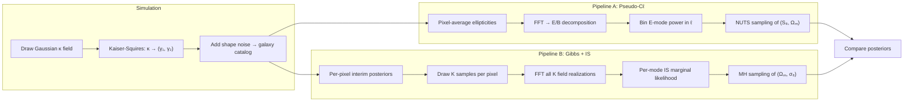
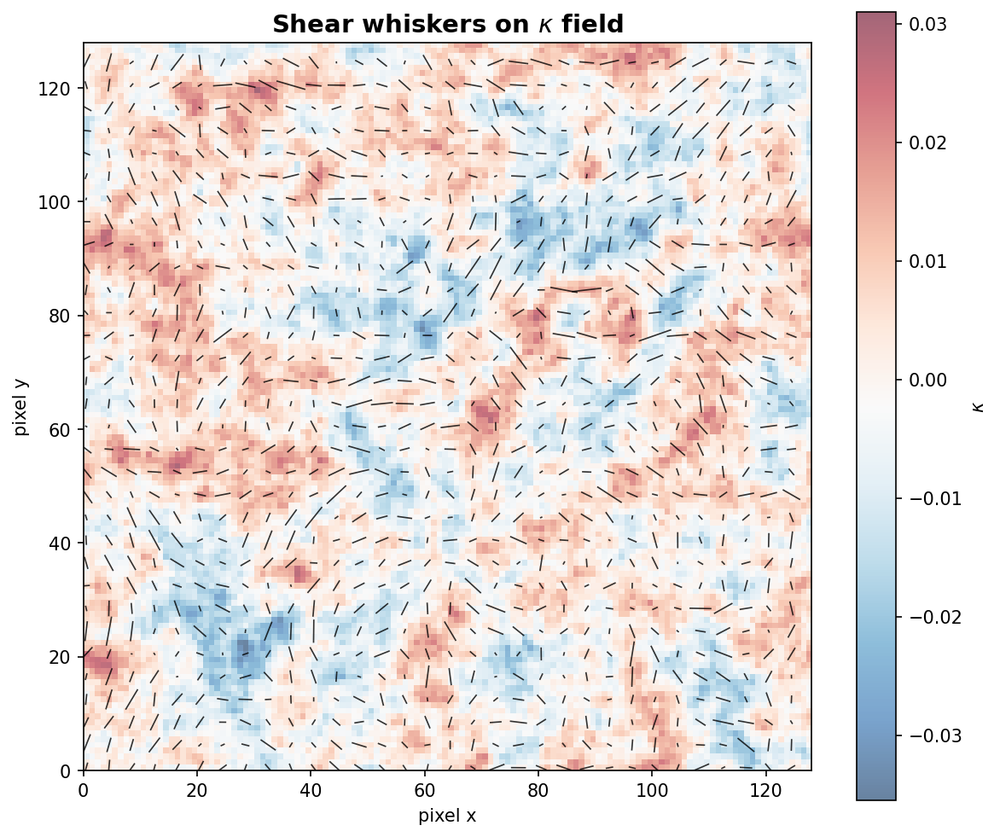
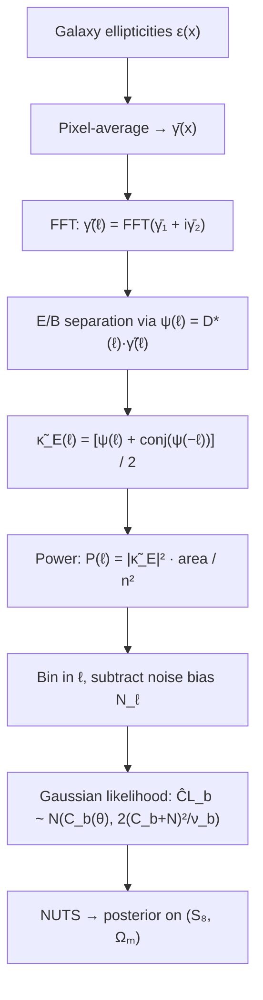
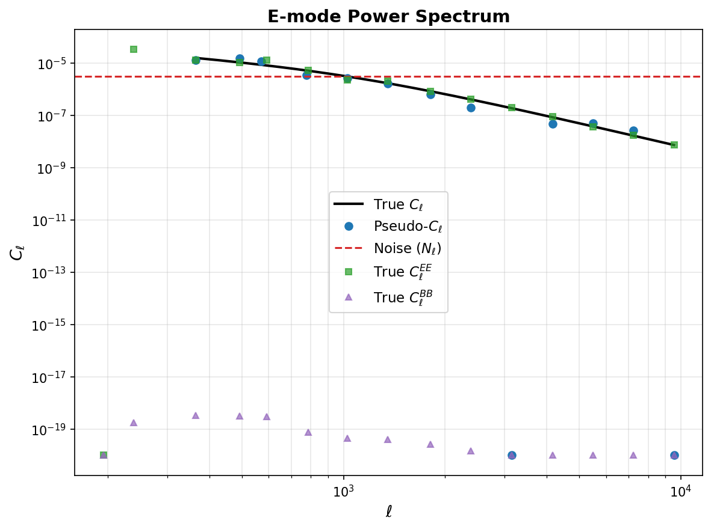
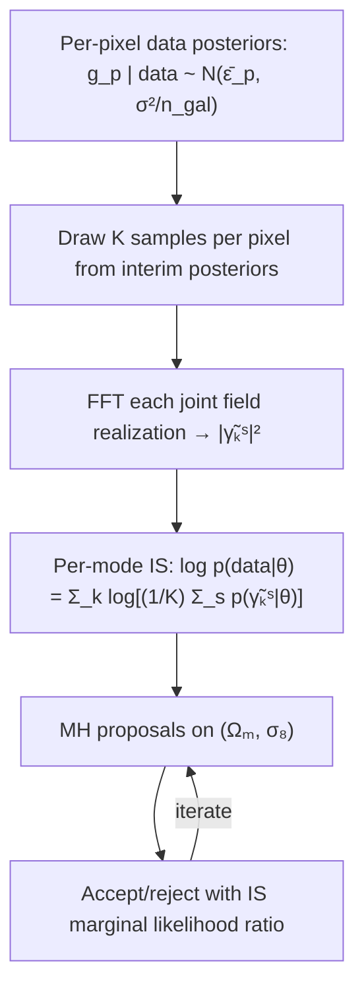
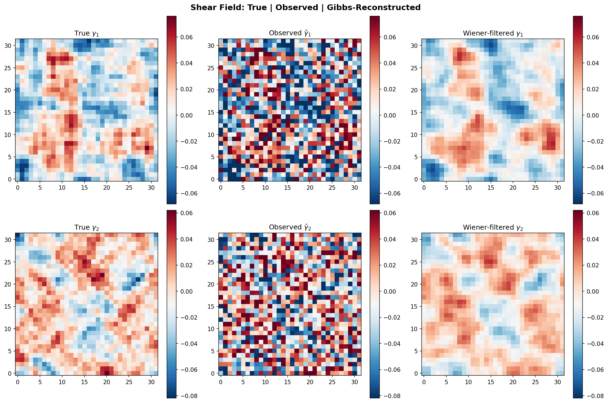
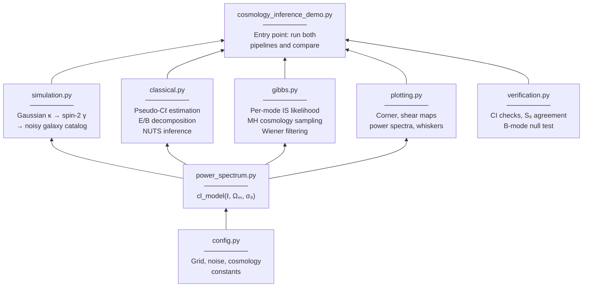

# Hierarchical Shear Inference Demo

Comparing two approaches to cosmological parameter inference from weak gravitational lensing shear data: a classical **pseudo-C&#8467;** power spectrum pipeline and a **hierarchical Gibbs + importance sampling** framework inspired by [Schneider et al. (2015)](https://doi.org/10.1088/0004-637X/807/1/87).

Both pipelines operate on the same simulated galaxy shear catalog and produce posterior constraints on the matter density parameter &Omega;<sub>m</sub> and the fluctuation amplitude &sigma;<sub>8</sub>, as well as the derived combination S<sub>8</sub> = &sigma;<sub>8</sub>&radic;(&Omega;<sub>m</sub>/0.3).

<p align="center">
  
</p>

## Overview

Weak gravitational lensing distorts the shapes of distant galaxies by a small amount (~1%), encoding information about the intervening matter distribution. Measuring these distortions across many galaxies constrains the cosmological parameters that govern the growth of structure.

This demo implements the full pipeline from simulation to posterior inference:



## The Physics

### Shear as a Spin-2 Field

Gravitational lensing shear (&gamma;<sub>1</sub>, &gamma;<sub>2</sub>) is a **spin-2** quantity: the two components are not independent but are related to the scalar convergence &kappa; through the Kaiser-Squires relation in Fourier space:

$$\tilde{\gamma}(\boldsymbol{\ell}) = D(\boldsymbol{\ell}) \, \tilde{\kappa}(\boldsymbol{\ell}), \qquad D(\boldsymbol{\ell}) = \frac{\ell_x^2 - \ell_y^2 + 2i\,\ell_x \ell_y}{|\boldsymbol{\ell}|^2}$$

This ensures that a pure convergence field produces **only E-mode** shear (no B-modes), analogous to the curl-free property of a gradient field. The simulation generates shear correctly via this relation, and B-mode power serves as a null test.

<p align="center">
  
</p>

### Power Spectrum Model

We use a parametric angular power spectrum that captures the essential S<sub>8</sub> degeneracy:

$$C_\ell = A_0 \, \sigma_8^2 \left(\frac{\Omega_m}{0.3}\right)^2 \left(\frac{\ell}{100}\right)^{-1} \frac{1}{1 + (\ell/1000)^2}$$

This is a simplified model (not a full Boltzmann code), but it exhibits the correct scaling with cosmological parameters and the characteristic S<sub>8</sub> degeneracy direction in the (&Omega;<sub>m</sub>, &sigma;<sub>8</sub>) plane.

## Pipeline A: Pseudo-C&#8467; + NUTS

The classical approach compresses the shear data into a binned power spectrum, then performs Bayesian inference:



**Key features:**
- Proper E/B decomposition isolates the lensing signal from potential systematics
- Bins with fewer than 5 Fourier modes are excluded (unreliable at low &#8467;)
- Parametrized as (S<sub>8</sub>, &Omega;<sub>m</sub>) with uniform priors to avoid prior-induced bias on S<sub>8</sub>
- Uses `target_accept_prob=0.9` for zero-divergence HMC sampling along the S<sub>8</sub> degeneracy

<p align="center">
  
</p>

## Pipeline B: Gibbs + Importance Sampling

The hierarchical approach avoids compressing to a summary statistic, instead marginalizing over the shear field:



Because i.i.d. pixel noise produces independent Fourier modes, the marginal likelihood factorizes over ~n² modes, making the IS estimate low-variance even with modest K. A second-order Jensen bias correction further reduces the IS bias from O(1/K) to O(1/K²).

## Shear Field Reconstruction

The Gibbs sampler also enables **Wiener-filtered** shear reconstruction, which optimally combines the noisy pixel-level data with the cosmological power spectrum prior:

<p align="center">
  
</p>

## Running

```bash
.venv/bin/python cosmology_inference_demo.py
```

The virtualenv (symlinked to the parent SHINE project) contains JAX, NumPyro, matplotlib, and scipy. The demo takes ~2 minutes on a modern CPU, dominated by the Gibbs sampler JIT compilation.

**Output:** plots saved to `plots/`, verification checks printed to stdout.

## Module Structure



| Module | Role |
|--------|------|
| `config.py` | All constants: grid size, noise levels, true cosmology, sampler settings |
| `power_spectrum.py` | Parametric C<sub>&#8467;</sub>(&Omega;<sub>m</sub>, &sigma;<sub>8</sub>) model |
| `simulation.py` | Gaussian &kappa; field, Kaiser-Squires shear, noisy galaxy catalog |
| `classical.py` | E-mode pseudo-C<sub>&#8467;</sub> estimation, Gaussian likelihood, NUTS |
| `gibbs.py` | Per-mode importance sampling, Metropolis-Hastings, Wiener filter |
| `plotting.py` | Density contour corner plots, shear maps, power spectra, whisker plots |
| `verification.py` | Truth-in-CI checks, cross-method S<sub>8</sub> agreement, B-mode null test |

## Default Configuration

| Parameter | Value | Description |
|-----------|-------|-------------|
| Grid size | 32 &times; 32 | Pixels per side |
| Pixel scale | 2.0 arcmin | Angular size per pixel |
| Galaxies/pixel | 30 | Number density |
| Shape noise | 0.26 per component | Intrinsic ellipticity dispersion |
| &Omega;<sub>m</sub> (true) | 0.3 | Matter density |
| &sigma;<sub>8</sub> (true) | 0.8 | Fluctuation amplitude |
| NUTS samples | 500 warmup + 2000 | Classical pipeline |
| MH iterations | 3000 (500 burn-in) | Gibbs pipeline |

## Known Issues

- The **Gibbs sampler** currently shows a systematic offset in &Omega;<sub>m</sub> (biased high), likely due to the MH proposal width or the interim-to-field IS reweighting. The S<sub>8</sub> constraint is more robust. Improving the Gibbs sampler is the next development priority.
- The demo uses a **simplified power spectrum model** (not a Boltzmann code), so absolute parameter values should not be compared to real survey results.

## References

- Schneider, M. D., et al. (2015). "Hierarchical Bayesian weak lensing: advantages and implementation." *The Astrophysical Journal*, 807(1), 87. [doi:10.1088/0004-637X/807/1/87](https://doi.org/10.1088/0004-637X/807/1/87)
- Kaiser, N. & Squires, G. (1993). "Mapping the dark matter with weak gravitational lensing." *The Astrophysical Journal*, 404, 441.
