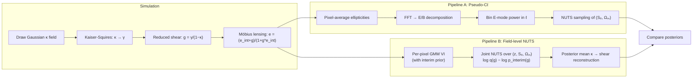
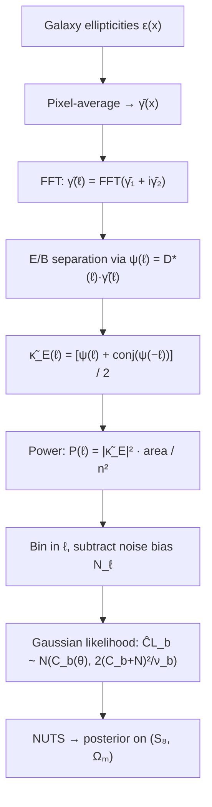
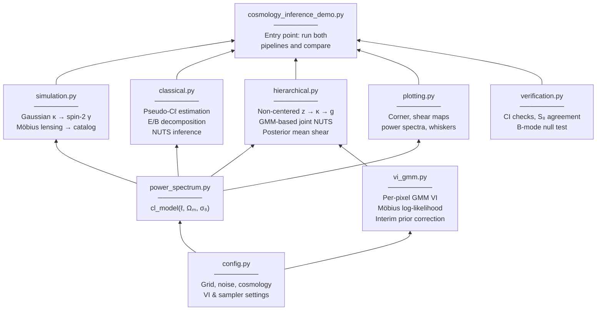

# Hierarchical Shear Inference Demo

Comparing two approaches to cosmological parameter inference from weak gravitational lensing shear data: a classical **pseudo-C&#8467;** power spectrum pipeline and a **field-level NUTS** sampler with **per-pixel GMM variational inference** that infers the convergence field and cosmological parameters simultaneously using the physically correct Möbius lensing model.

Both pipelines operate on the same simulated galaxy shear catalog — generated with the full **reduced shear + Möbius lensing** transformation — and produce posterior constraints on the matter density parameter &Omega;<sub>m</sub> and the fluctuation amplitude &sigma;<sub>8</sub>, as well as the derived combination S<sub>8</sub> = &sigma;<sub>8</sub>&radic;(&Omega;<sub>m</sub>/0.3).

<p align="center">
  
</p>

## Overview

Weak gravitational lensing distorts the shapes of distant galaxies by a small amount (~1%), encoding information about the intervening matter distribution. Measuring these distortions across many galaxies constrains the cosmological parameters that govern the growth of structure.

This demo implements the full pipeline from simulation to posterior inference:



## The Physics

### Shear as a Spin-2 Field

Gravitational lensing shear (&gamma;<sub>1</sub>, &gamma;<sub>2</sub>) is a **spin-2** quantity: the two components are not independent but are related to the scalar convergence &kappa; through the Kaiser-Squires relation in Fourier space:

$$\tilde{\gamma}(\boldsymbol{\ell}) = D(\boldsymbol{\ell}) \, \tilde{\kappa}(\boldsymbol{\ell}), \qquad D(\boldsymbol{\ell}) = \frac{\ell_x^2 - \ell_y^2 + 2i\,\ell_x \ell_y}{|\boldsymbol{\ell}|^2}$$

This ensures that a pure convergence field produces **only E-mode** shear (no B-modes), analogous to the curl-free property of a gradient field. The simulation generates shear correctly via this relation, and B-mode power serves as a null test.

### Möbius Lensing

Galaxies are not observed with the shear &gamma; directly but with the **reduced shear** $g = \gamma / (1 - \kappa)$, combined with their intrinsic ellipticity via the Möbius transformation:

$$e_\mathrm{obs} = \frac{e_\mathrm{int} + g}{1 + g^* \, e_\mathrm{int}}$$

where $e_\mathrm{int} \sim \mathcal{N}(0, \sigma_e^2 \, \mathbf{I})$ per component (Rayleigh magnitude, uniform orientation). This non-linear transformation means the per-galaxy log-likelihood is:

$$\log p(e_\mathrm{obs} \mid g) = -\frac{|e_s|^2}{2\sigma^2} - \log(2\pi\sigma^2) + 2\log(1 - |g|^2) - 2\log|1 - g^* \, e_\mathrm{obs}|^2$$

where $e_s = (e_\mathrm{obs} - g) / (1 - g^* \, e_\mathrm{obs})$ is the inferred source ellipticity. In the weak-lensing regime ($|\kappa| \ll 1$), $g \approx \gamma$ and this reduces to the standard linear model, but the full Möbius form is used throughout for correctness.

<p align="center">
  
</p>

### Power Spectrum Model

We use a parametric angular power spectrum that captures the essential S<sub>8</sub> degeneracy:

$$C_\ell = A_0 \, \sigma_8^2 \left(\frac{\Omega_m}{0.3}\right)^2 \left(\frac{\ell}{100}\right)^{-1} \frac{1}{1 + (\ell/1000)^2}$$

This is a simplified model (not a full Boltzmann code), but it exhibits the correct scaling with cosmological parameters and the characteristic S<sub>8</sub> degeneracy direction in the (&Omega;<sub>m</sub>, &sigma;<sub>8</sub>) plane.

## Pipeline A: Pseudo-C&#8467; + NUTS

The classical approach compresses the shear data into a binned power spectrum, then performs Bayesian inference:



**Key features:**
- Proper E/B decomposition isolates the lensing signal from potential systematics
- Bins with fewer than 5 Fourier modes are excluded (unreliable at low &#8467;)
- Parametrized as (S<sub>8</sub>, &Omega;<sub>m</sub>) with uniform priors to avoid prior-induced bias on S<sub>8</sub>
- Uses `target_accept_prob=0.9` for zero-divergence HMC sampling along the S<sub>8</sub> degeneracy

<p align="center">
  
</p>

## Pipeline B: Field-level NUTS

The field-level approach jointly samples the convergence field and cosmological parameters using a **non-centered parameterization** that is amenable to gradient-based NUTS sampling in ~16,000 dimensions. Because the Möbius lensing model makes the per-pixel likelihood non-Gaussian, the pipeline has two stages: **GMM variational inference** to compress the galaxy-level data, followed by **joint NUTS sampling**.

### Stage 1: Per-pixel GMM variational inference

The key insight from [Schneider et al. (2015)](https://doi.org/10.1088/0004-637X/807/1/87) is that per-pixel posteriors on shear can serve as **sufficient data summaries** for hierarchical cosmological inference. With the Möbius lensing model, the per-pixel likelihood $p(\{e_i\} \mid g)$ over $n_\mathrm{gal}$ galaxies is non-Gaussian, so we approximate it using a $K$-component **Gaussian mixture model** (GMM).

To regularize the VI optimization, we fit the GMM to the **interim posterior** rather than the raw likelihood:

$$q(g) \approx p(\{e_i\} \mid g) \times p_\mathrm{interim}(g), \qquad p_\mathrm{interim}(g) = \mathcal{N}(0, \sigma_\mathrm{interim}^2 \, \mathbf{I})$$

The GMM parameters (weights, means, Cholesky-factored covariances) are optimized by maximizing the reparameterized ELBO using `optax.adam` + `jax.lax.scan`. The interim prior ($\sigma_\mathrm{interim} = 0.15$, ~3&times; wider than the posterior) ensures the VI converges quickly with correct posterior widths — without it, the GMM components collapse to overly narrow distributions that bias the downstream cosmological inference.

### Stage 2: Joint NUTS with interim prior correction

Rather than sampling the convergence field $\kappa$ directly (which would be strongly correlated with the cosmological parameters through the power spectrum), we use a **non-centered parameterization** with a white-noise latent field $z$:

$$z_{ij} \sim \mathcal{N}(0, 1) \quad \text{(i.i.d. standard normal on the } n \times n \text{ grid)}$$

$$\tilde{\kappa}(\boldsymbol{\ell}) = \sqrt{\frac{C_\ell(\Omega_m, \sigma_8)}{\mathcal{A}}} \; \tilde{z}(\boldsymbol{\ell})$$

$$\tilde{\gamma}(\boldsymbol{\ell}) = D(\boldsymbol{\ell}) \, \tilde{\kappa}(\boldsymbol{\ell}), \qquad g_p = \frac{\gamma_p}{1 - \kappa_p}$$

The effective per-pixel log-likelihood used by NUTS is the GMM approximation with the interim prior subtracted:

$$\log p_\mathrm{eff}(g_p) = \log q(g_p) - \log p_\mathrm{interim}(g_p)$$

This recovers the data log-likelihood $\log p(\{e_i\} \mid g_p)$ up to a constant: the GMM was fitted to $p(\mathrm{data}|g) \times p_\mathrm{interim}(g)$, so dividing out $p_\mathrm{interim}$ leaves just the data term. The total log-likelihood sums over all pixels.

where $\tilde{z} = \mathrm{FFT}(z)$, $\mathcal{A} = (n \, \Delta)^2$ is the survey area, and $\gamma_p = \mathrm{IFFT}(\tilde{\gamma})$ evaluated at pixel $p$. The normalization $\sqrt{C_\ell / \mathcal{A}}$ accounts for the fact that $|\tilde{z}(\boldsymbol{\ell})|^2$ has expectation $n^2$ (from the unnormalized FFT of $n^2$ i.i.d. unit normals), producing the correct field power $\mathbb{E}[|\tilde{\kappa}(\boldsymbol{\ell})|^2] = C_\ell \, n^2 / \mathcal{A}$.

The total parameter space is $n^2 + 2 = 16{,}386$ dimensions (for $n = 128$). The non-centered parameterization decouples the prior on $z$ from the cosmological parameters, making the posterior geometry more amenable to NUTS. Cosmology enters only through the deterministic coloring $\sqrt{C_\ell}$, so the sampler can efficiently adapt its mass matrix to the different scales of the $z$ field and the cosmological parameters.

### NUTS configuration

The joint sampler uses NumPyro's NUTS with:
- `target_accept_prob=0.8` (slightly lower than the pseudo-C&#8467; pipeline due to the higher dimensionality)
- `max_tree_depth=8` (sufficient for the moderate correlations in the non-centered parameterization)
- Same (S<sub>8</sub>, &Omega;<sub>m</sub>) uniform priors as Pipeline A, with &sigma;<sub>8</sub> derived as S<sub>8</sub> / &radic;(&Omega;<sub>m</sub>/0.3)

## Shear Field Reconstruction

The field-level sampler produces **posterior samples of the convergence field** $\kappa$ as a byproduct. The posterior mean $\langle \kappa \rangle$ is then mapped to shear via Kaiser-Squires, providing an optimally denoised reconstruction:

<p align="center">
  
</p>

## Running

```bash
.venv/bin/python cosmology_inference_demo.py
```

The virtualenv (symlinked to the parent SHINE project) contains JAX, NumPyro, optax, matplotlib, and scipy. The demo takes ~2 minutes on a modern CPU (dominated by the per-pixel GMM VI step).

**Output:** plots saved to `plots/`, verification checks printed to stdout.

## Module Structure



| Module | Role |
|--------|------|
| `config.py` | All constants: grid size, noise levels, true cosmology, VI settings, sampler settings |
| `power_spectrum.py` | Parametric C<sub>&#8467;</sub>(&Omega;<sub>m</sub>, &sigma;<sub>8</sub>) model |
| `simulation.py` | Gaussian &kappa; field, Kaiser-Squires shear, reduced shear, Möbius lensing galaxy catalog |
| `classical.py` | E-mode pseudo-C<sub>&#8467;</sub> estimation, Gaussian likelihood, NUTS |
| `vi_gmm.py` | Per-pixel GMM variational inference with interim prior, Möbius log-likelihood, ELBO optimization |
| `hierarchical.py` | Two-stage field-level pipeline: GMM VI + joint NUTS over (z, S<sub>8</sub>, &Omega;<sub>m</sub>) with interim prior correction |
| `plotting.py` | Density contour corner plots, shear maps, power spectra, whisker plots |
| `verification.py` | Truth-in-CI checks, cross-method S<sub>8</sub> agreement, B-mode null test |

## Default Configuration

| Parameter | Value | Description |
|-----------|-------|-------------|
| Grid size | 128 &times; 128 | Pixels per side |
| Pixel scale | 1.0 arcmin | Angular size per pixel |
| Galaxies/pixel | 30 | Number density |
| Shape noise | 0.26 per component | Intrinsic ellipticity dispersion |
| &Omega;<sub>m</sub> (true) | 0.3 | Matter density |
| &sigma;<sub>8</sub> (true) | 0.8 | Fluctuation amplitude |
| GMM components | 2 | Per-pixel mixture components |
| VI steps | 2000 | ELBO optimization steps (converges in ~50) |
| Interim prior &sigma; | 0.15 | Isotropic Gaussian on reduced shear |
| NUTS samples (pseudo-C&#8467;) | 500 warmup + 2000 | Classical pipeline |
| NUTS samples (field-level) | 500 warmup + 2000 | Hierarchical pipeline (16,386 dims) |

## References

- Schneider, M. D., et al. (2015). "Hierarchical Bayesian weak lensing: advantages and implementation." *The Astrophysical Journal*, 807(1), 87. [doi:10.1088/0004-637X/807/1/87](https://doi.org/10.1088/0004-637X/807/1/87)
- Kaiser, N. & Squires, G. (1993). "Mapping the dark matter with weak gravitational lensing." *The Astrophysical Journal*, 404, 441.
